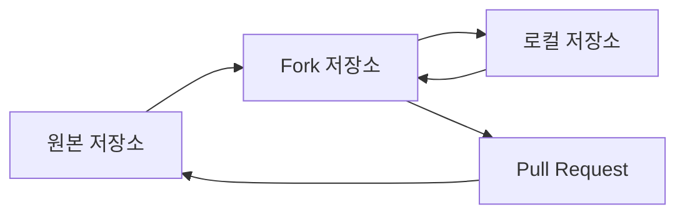

### 📚 **GitHub Fork & Branch 완벽 가이드 📚**

GitHub에서 효율적인 협업을 위한 \*\*`Fork`\*\*와 **`Branch`** 전략 가이드.

-----

### **📋 목차**

  * \*\*`Fork`\*\*란 무엇인가?
  * \*\*`Branch`\*\*란 무엇인가?
  * \*\*`Fork`\*\*를 선택하는 이유
  * \*\*`Fork`\*\*의 장점
  * \*\*`Fork`\*\* 사용법
  * \*\*`Pull Request`\*\*란?
  * \*\*`Git Flow`\*\*란?

-----

### **🔄 Fork란 무엇인가?**

\*\*`Fork`\*\*는 다른 사람의 GitHub 저장소를 내 계정으로 **복사**하는 기능입니다.

#### Fork의 개념

마치 도서관에서 책을 빌려와서 집에서 공부하는 것과 같습니다.

  * \*\*원본 책(저장소)\*\*은 도서관에 그대로 두고
  * **복사본**을 가져와서 자유롭게 메모하고 수정할 수 있어요.
  * 좋은 아이디어가 생기면 원작자에게 "**이렇게 바꾸면 어때요?**"라고 제안할 수 있습니다.

#### Fork vs 일반 복사의 차이점

  * **일반 복사**: 단순히 파일만 복사합니다. (원본과 연결 없음)
  * **`Fork`**: GitHub에서 원본과 연결된 상태로 복사합니다. (업데이트 및 기여 가능)

-----

### **🌿 Branch란 무엇인가?**

\*\*`Branch`\*\*는 현재 커밋을 기준으로 새로운 개발 경로를 생성하여, 메인 코드에 영향을 주지 않고 독립적으로 작업할 수 있는 환경을 만드는 것이다.

#### 왜 Branch를 사용할까?

**상황**: 웹사이트에 로그인 기능을 추가하고 싶다면?

  * ❌ **`Branch` 없이**: 메인 코드를 직접 수정 → 실수하면 전체 사이트가 망가집니다.
  * ✅ **`Branch` 사용**: `login-feature` 브랜치 생성 → 안전하게 실험 → 완성되면 메인에 합칩니다.

<!-- end list -->

```
# GitHub 웹에서 Fork 버튼 클릭 후
git clone https://github.com/your-username/repo-name.git
```

### Fork와 Branch의 차이점

---

## Fork - 이웃집 복사하기 🏠

### 개념
**Fork**는 다른 사람의 프로젝트를 내 GitHub 계정으로 복사해서 자유롭게 수정할 수 있게 하는 기능입니다.

### 집 비유로 이해하기
이웃집이 정말 예쁘게 지어져 있다고 생각해보세요. 그 집의 설계도를 받아서 내 땅에 똑같은 집을 지었습니다. 이제 이 집은 완전히 내 것이 되어서:

- 🎨 마음대로 인테리어를 바꿀 수 있고
- 🏗️ 방을 더 만들거나 구조를 변경할 수 있고
- 🌱 정원도 내 취향대로 꾸밀 수 있습니다

원본 이웃집은 전혀 건드리지 않으면서도, 내가 완전히 소유한 새로운 집에서 자유롭게 실험할 수 있는 것이죠.

내가 집을 다 고치고 나서 원본 집 주인에게 "제가 이렇게 고쳤는데, 마음에 드시면 제 집의 변화를 원본 집에 반영해 주세요!"라고 요청하는 게 바로 **Pull Request**예요.

---

## Git Branch - 새로운 방 증축하기 🏗️

### 개념
**Branch**는 메인 코드에서 분기해서 독립적으로 작업할 수 있는 공간입니다.

### 집 비유로 이해하기 (가장 정확한 비유!)
내가 살고 있는 집에서 새로운 기능이나 실험을 해보고 싶을 때를 생각해보세요:

- 🏠 **기존 집(main branch)**: 가족이 안전하게 생활하는 공간
- 🏗️ **새 방 증축(feature branch)**: 기존 집에 완전히 독립적인 새 방을 만들기

새로 증축한 방에서는:
- ✅ 마음대로 실험하고 꾸밀 수 있음
- ✅ 기존 집 생활에 전혀 영향 없음
- ✅ 실패해도 그냥 철거하면 됨
- ✅ 성공하면 본채와 연결해서 활용

-----

### **🎯 Fork를 선택하는 이유**

#### 1\. 권한 관리의 명확성



#### 2\. 안전한 실험 환경

  * 원본 코드에 영향 없이 자유로운 수정 가능
  * 실패해도 원본에는 전혀 영향 없음
  * 언제든지 원본에서 최신 변경사항 동기화 가능

#### 3\. 오픈소스 기여의 표준

  * 대부분의 오픈소스 프로젝트에서 요구하는 방식
  * 기여자와 메인테이너 간의 명확한 역할 분담
  * 코드 리뷰 프로세스의 표준화

-----

### **✨ Fork의 장점**

#### 🛡️ 보안성

  * **격리된 환경**: 원본 저장소와 완전히 분리된 작업 공간
  * **권한 제한**: 원본에 직접 영향을 주지 않음
  * **안전한 테스트**: 모든 실험이 자신의 환경에서만 진행

#### 🤝 협업 효율성

  * **병렬 작업**: 여러 개발자가 동시에 다른 기능 개발 가능
  * **체계적 리뷰**: Pull Request를 통한 코드 리뷰 프로세스
  * **버전 관리**: 각 기여의 히스토리가 명확히 추적

#### 🔄 유연성

  * **독립적 개발**: 자신만의 속도로 개발 진행
  * **실험적 기능**: 메인 브랜치에 영향 없이 새로운 아이디어 테스트
  * **맞춤형 수정**: 개인적 필요에 따른 코드 수정 가능

-----

### **🚀 Fork 사용법 (3단계로 완성\!)**

**1️⃣ GitHub에서 Fork하기**

  * 원하는 저장소 페이지로 이동
  * 우상단 **`Fork`** 버튼 클릭
  * 내 계정으로 복사 완료\! 🎉

**2️⃣ 내 컴퓨터로 가져오기**

```
# 내가 Fork한 저장소를 다운로드
git clone https://github.com/your-username/repo-name.git
cd repo-name

# 원본 저장소 연결 (나중에 업데이트 받기 위해)
git remote add upstream https://github.com/원본소유자/저장소이름.git
```

**3️⃣ 작업하고 올리기**

```
# 새로운 기능을 위한 브랜치 만들기
git checkout -b my-feature

# 코드 수정 후 저장
git add .
git commit -m "새로운 기능 추가"

# 내 Fork에 업로드
git push origin my-feature
```

💡 **Tip**: 이제 GitHub에서 Pull Request를 보낼 수 있어요\!

-----

### **📤 Pull Request란?**

**`Pull Request`**(`PR`)는 "**내가 만든 변경사항을 원본 프로젝트에 합쳐달라**"고 요청하는 GitHub 기능입니다.

### 비유
회사에서 업무 프로세스를 개선할 아이디어가 떠올랐다고 생각해보세요. 혼자 몰래 바꿔버리면 큰일이죠. 대신 상사에게 "이런 방식으로 바꾸면 어떨까요?"라고 제안서를 제출합니다. 

Pull Request도 마찬가지로 "제가 이런 기능을 추가했는데, 메인 프로젝트에 합쳐주실 수 있나요?"라고 정중히 요청하는 과정입니다.

### PR의 구성 요소
- **제목**: 변경 내용을 한 줄로 요약
- **설명**: 왜 이 변경이 필요한지, 어떤 문제를 해결하는지
- **코드 리뷰**: 다른 개발자들이 코드를 검토
- **토론**: 개선점에 대한 의견 교환

#### Pull Request의 장점

  * **안전함**: 원본을 직접 바꾸지 않고 제안만 합니다.
  * **검토 가능**: 다른 사람들이 내 변경사항을 확인할 수 있습니다.
  * **협업**: 여러 명이 동시에 다른 기능을 개발할 수 있습니다.

-----

### **🚦 Git Flow란?**

\*\*`Git Flow`\*\*는 소프트웨어 개발의 효율적인 협업을 위해 고안된 **브랜치(branch) 관리 전략** 중 하나입니다. 여러 브랜치를 역할에 따라 나누고, 정해진 규칙에 맞춰 코드를 병합(merge)함으로써 프로젝트의 안정성과 효율성을 높이는 방법입니다.

-----
